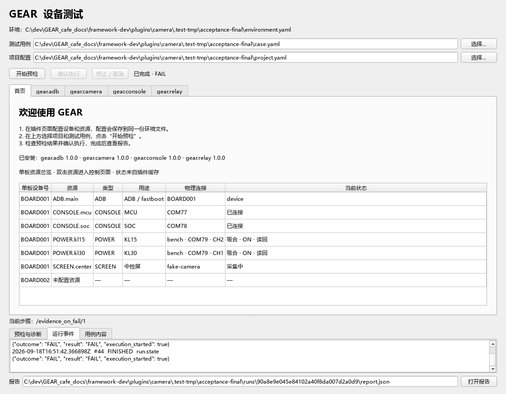
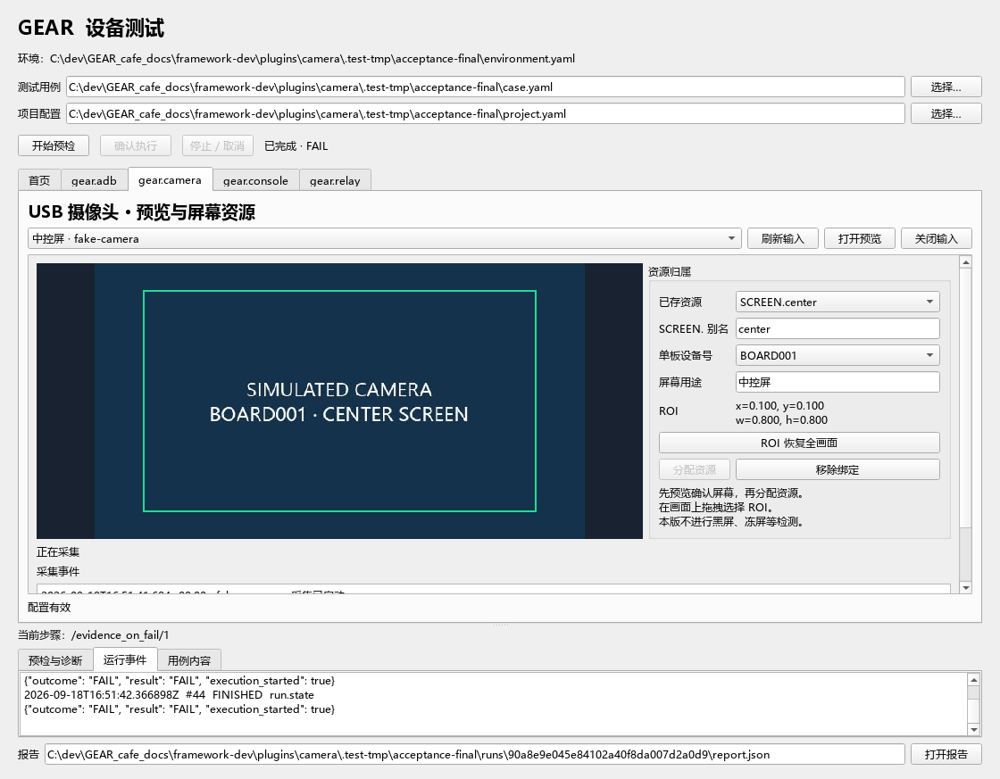

# 四插件业务重构交付记录

日期：2026-09-19。依据 [业务约定](board-resources.md) 和 [实施计划](2026-09-19-implementation-plan.md)。

## 业务落实

单板设备号（ADB / fastboot 共用的序列号）是唯一逻辑身份，沿用已有 devices 与资源顶层 device。单板可以只有部分资源。未用的 MCU/SOC、KL15/KL30、屏幕均不自动生成占位。

| 范围 | 已实现 |
|---|---|
| ADB | USB ADB / fastboot；device、recovery、sideload、fastboot、offline、unauthorized、missing 独立展示；命令、输出、拉日志和模式/输出条件；显式后台观察 |
| 继电器 | 多个独立 COM 控制器，每控制器 CH1–CH8；通道绑定设备号和任意用途；KL15/KL30 是两条通道；按钮仅吸合/释放；写回执及状态读回共享到 GUI |
| CH340 | 每板最多 MCU/SOC 各一条；独占 COM；单 I/O 线程持续收发，命令、快捷输入、文本条件、Run 游标日志取证 |
| 摄像头 | 每板最多六输入；输入独占、预览、设备号与屏幕用途、归一化 ROI、采集事件、STREAMING 和 SNAPSHOT；未实现图像检测算法 |
| 总 GUI | 首页显示单板—资源—用途—物理连接—状态；双击导航插件；展示归档用例、当前步骤、带时间戳的运行事件和报告路径 |

各资源连接由插件长期持有，GUI 与 Run 共享同一服务；end_run 不关闭会话连接。Run 内禁止人工控制和配置编辑，状态/串口输出/摄像头预览继续刷新。后台采集不跨用例保留 Run context；用例仍按现有框架完全独占，收尾完成才释放会话。

继电器不推断电源语义、不安排 KL15/KL30 的自动操作顺序；状态的来源明确区分写回执与线圈读回，不宣称机械触点的物理反馈。保存不完整配置仍允许编辑，预检只做静态配置检查。继电器旧未绑定通道的占位仍为 INCOMPLETE，必须补齐或明确移除。

## 修改范围核查

生产代码全部在 plugins/adb、plugins/relay、plugins/console、plugins/camera 内。唯一插件外改动是用户允许的纯 GUI 文件 src/gear_framework/desktop.py，仅投影既有环境数据、订阅既有 RunEvent、托管和导航已有 Workspace。

未修改 Framework 核心、DSL、公共合约、根测试、根 environment.yaml 或根依赖清单。未新增全局依赖、未进行 Git 提交/推送。新测试、文档、截图及临时产物都在插件目录中。Workspace 的 resource_statuses()/select_resource() 只是 GUI 层可选私有方法，不是公共合约扩展。

摄像头复用已安装 Qt Multimedia，在插件私有无窗口子进程内持有输入；父 Runtime 仍为纯 Python 配置和缓存层。无需给核心增加相机接口或事件协议。

## 验证记录

- 原有根测试：**141 passed**。
- ADB 插件测试：**59 passed**。
- 继电器插件测试：**152 passed**。
- 摄像头及新增总 GUI 测试：**31 passed**。
- 串口插件测试：**92 passed**，含断开/故障后 COM 重新分配、同长度新日志及清屏游标的审查回归，见 [串口实施报告](../console/implementation-report.md)。
- 上述 pytest 合计 **475 项全部通过**，由主任务在最终代码上分别执行确认。
- 四插件真实 Framework + Qt 联调：构造/预检不触发 I/O；取消一次预检；预先打开共享会话；连续 **2 PASS + 1 预期 FAIL**；失败报告包含相机图片/ROI 和串口记录；用例间连接保持，退出全部关闭。
- 生产模块按 Python 3.11 AST 解析通过。git diff --check 通过；根目录变更仅获准的 desktop.py。

联调采用假 ADB、假串口、假相机和合成图像。模拟脚本禁止真实工具进程和 WinDLL 设备调用，COM77/78/79 只是虚拟配置。未枚举或打开任何现场 COM/摄像头；未访问 COM3。单插件测试另覆盖真实 Qt 控件、假 Win32 API、Modbus 帧组装、关闭等待和故障边界。

复现入口：plugins/camera/integration/simulate_board.py。临时应用、报告和 screenshots 均输出到命令指定的插件临时目录，默认生产环境不受影响。运行 pytest 时必须将 TEMP/TMP 和 --basetemp 指向插件目录，各插件测试分别执行，根 Framework 回归顺序执行。

## 独立审查处理

- 摄像头排队控制改为在 GUI 线程固定目标输入，不从工作线程读取可切换的控件。
- 显式重开可恢复停止的输入和退出的采集进程；父管道断开不妨碍所有输入释放与进程退出。
- 未完成/重复摄像头记录可在界面选中并删除。
- 总览遇到无效控制器配置仍显示诊断，不阻止 GUI 启动。
- 串口按实际服务实例保留资源所有权，明确断开和故障关闭后的 COM 重分配均不会误控新所有者；日志按服务代次重置 GUI 游标，同长度新文本也会刷新，见串口报告。

## 验收边界

没有真实设备，故没有声称硬件验收通过。现场仍需验证实际 Platform-Tools 模式切换、Modbus 控制器线圈映射、CH340 编码/波特率及多摄像头 USB 带宽和拔插。摄像头本次不检测黑屏/闪黑/冻屏/花屏；串口有明确的有界缓存与截断报告。

Fastboot 必须配置工具路径。为保证 USB-only，发现前只读检查官方工具的用户网络设备登记；存在网络登记或不能确认时拒绝启动 fastboot 查询。这个限制不影响 ADB，且不修改用户登记文件。

## 资料

- [ADB](implementation-report.md)
- [继电器](../relay/implementation-report.md)
- [串口](../console/implementation-report.md)
- [摄像头](../../../plugins/camera/README.md)

以下截图来自模拟验收，画面和设备均为假数据：

