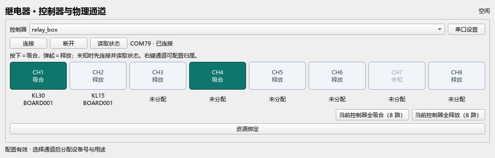
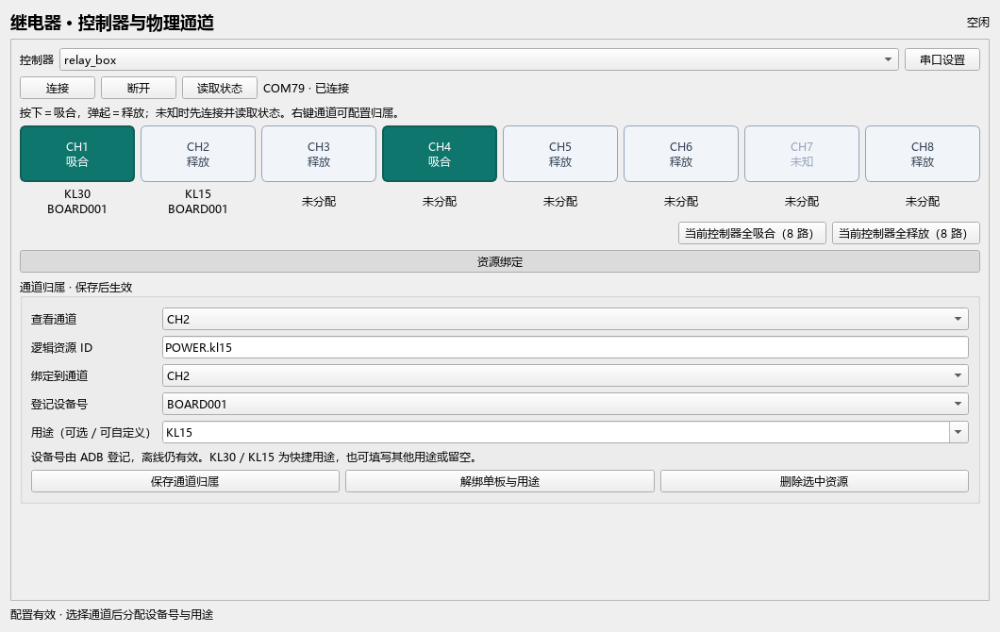

# 继电器紧凑页面

2026-09-19，根据用户反馈把八行表格改为一排八个状态按钮；核心、DSL、串口协议和 Runtime 未修改。

- 页签显示“继电器”；其他页签为 ADB、串口、摄像头。
- 选择控制器后直接看 CH1–CH8。绿色按下表示吸合；弹起表示释放。没有有效缓存、未连接或故障显示未知，不冒充释放。
- 按钮下显示用途和所属设备号，完整资源 ID 与设备号可悬停查看。通道状态来源在按钮提示中区分回执/读回。
- 点击提交当前控制器和通道的相反状态；请求排队中保持已知状态，完成后显示实际缓存。失败显示诊断，不残留一个假吸合状态。
- 串口设置与资源绑定默认收起；展开资源绑定可按通道查看、更改归属、移动通道、解绑或删除。右键通道按钮也可导航归属。
- 旧未完成/冲突资源继续单独列出，仍保持 INCOMPLETE/INVALID，不静默删除。
- ACTIVE 期间按钮禁用但 checked 状态继续随缓存刷新；导航和观察不触发串口 I/O。

以下截图均使用假串口和缓存数据，未访问真实硬件。已检查 1060×340 紧凑页与展开归属表单。

资源如何配置、用例如何引用，见 [完整 Demo](../../../plugins/relay/examples/board-demo/README.md)。
