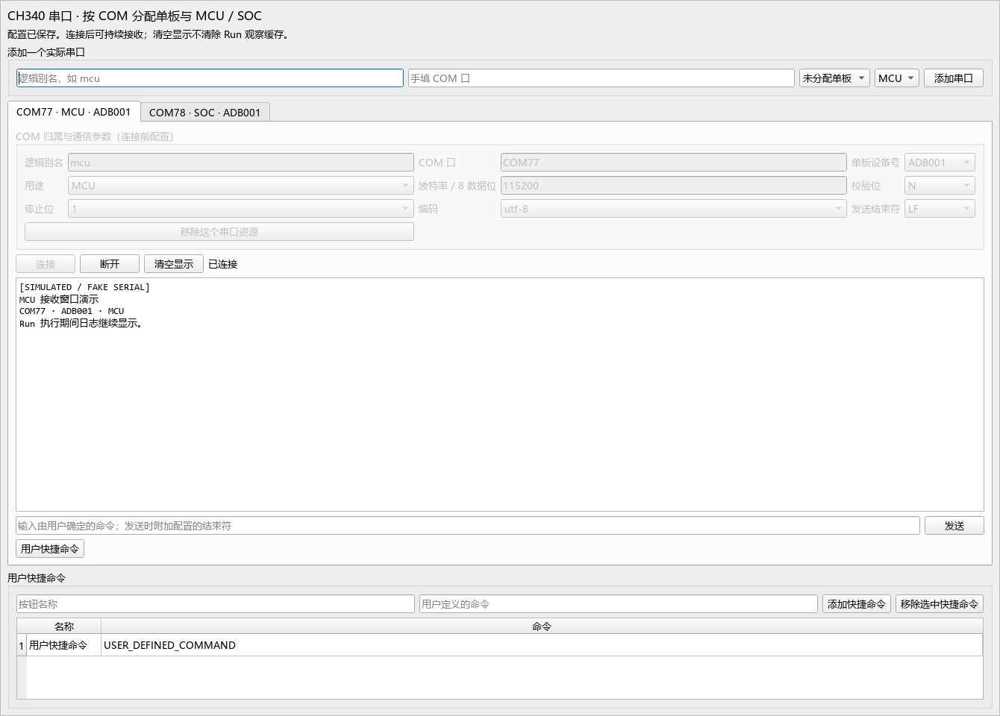

# GEAR CH340 串口插件

`gear.console` 为 CH340 接入的 MCU / SOC 串口提供持续接收、手动命令和 GEAR v1 用例能力。Windows COM 适配器随插件提供，不依赖 pyserial，不枚举或自动探测端口。

## 单板与物理端口

- 单板身份使用宿主登记的 ADB 设备号，保存于资源顶层 `device`。
- 每个实际 COM 口对应一个 `CONSOLE.<alias>` 资源，一个 COM 不得由多个资源占用。
- 同一单板至多一个 MCU、一个 SOC；任意一类均可缺省。空配置不生成占位。
- 未选择单板或未填串口/用途的资源为 `INCOMPLETE`；重复占用、重复角色或通信参数错误为 `INVALID`。
- 单板离线不会删除绑定；宿主负责检查悬空的设备号引用。

在 GUI 中先手填实际 COM，再指定单板设备号和 MCU/SOC。每个端口有独立终端标签页、输出框、命令输入、连接/断开、清空显示及用户快捷命令。没有任何内置车机命令。文本字段在 Enter/失焦时保存，选择字段立即保存。资源连接期间先断开再修改参数。页面外层可滚动，不会为了容纳配置区而撑高宿主窗口。

`Workspace.resource_statuses()` 返回缓存状态，`Workspace.select_resource(resource_id)` 定位终端并返回是否找到；两者均无设备 I/O。

界面示例（全部为模拟串口数据）：



## 私有配置

资源配置示例见 [plugin-slice.yaml](examples/plugin-slice.yaml)。它是宿主切片示例，不是另一个环境文件。真实配置只经 WorkspaceContext 写入宿主管理的唯一环境。

| 配置 | 可选值 / 默认值 |
| --- | --- |
| `port` | 必填，手填 COM 数字，例如 COM77；大小写规范为大写 |
| `role` | 必填，MCU 或 SOC |
| `baudrate` | 默认 115200，正整数 |
| `parity` | N / E / O，默认 N |
| `stopbits` | 1 / 2，默认 1 |
| `data_bits` | 固定 8 |
| `encoding` | utf-8 / gbk，默认 utf-8 |
| `line_ending` | LF / CRLF / CR，默认 LF |

插件级配置只有 `shortcuts`，格式为 `[{label: 用户名称, command: 用户命令}]`，默认空列表。所有终端共用这些按钮定义，按钮只向当前终端发送。快捷命令和普通发送均附加配置的结束符；不要在命令末尾重复添加换行，除非确有此意。

## 用例能力

| 能力 | 参数 | 语义 |
| --- | --- | --- |
| 操作 `SEND` | `command: string` | 按编码加结束符发送，成功表示系统接受全部字节，不表示目标执行成功 |
| 条件 `OUTPUT_CONTAINS` | `text: string` | 检查本 Run 开始之后的接收文本是否包含该子串；不解释正则 |
| 条件 `CONNECTED` | 无 | 读取缓存的端口连接状态，不证明目标单板响应 |
| 证据 `TRANSCRIPT` | 无 | 捕获当前 Run 尚保留的接收文本、游标、截断和串口故障元数据 |

字符串参数长度为 1–65536 个字符。示例 [case.yaml](examples/case.yaml) 和 [project.yaml](examples/project.yaml) 使用明确的用户占位文本，运行前请替换为自己的命令和预期输出。

导入、工厂、`configure`、静态验证和 `begin_run` 不打开设备。`SEND` 与 `OUTPUT_CONTAINS` 可在执行阶段按归档配置首次打开；`CONNECTED` 只观察缓存。GUI 必须显式点击连接。接收错误返回 `ok: false` 和稳定诊断，不伪装成普通条件不满足，也不自动重连。

## 连接、观察及停止

一个 COM 对应一个长期服务和一个 I/O 线程。该线程执行打开、有限超时读取、排队写入和关闭，避免同一 Win32 句柄的 `SetCommTimeouts` 在并发读写间互相覆盖。每个端口独立，两个串口可同时接收。

- 连续字节采用增量解码，支持跨读取分片的中文。非法编码序列显示替换字符；发送无法按所选编码表达的字符时返回错误。
- 默认每 COM 保留最近 262144 个字符，不无限增长。每个 Run 在开始时记录游标，排除先前输出及先前残留的半个多字节字符。
- 如果 Run 早期内容被淘汰，仍保留的匹配可返回 true；未匹配时返回 `CONSOLE_CACHE_GAP`，不会错误断言完整 Run 未出现目标文本。证据注明截断，不能恢复淘汰的内容。
- “清空显示”仅改变界面游标；Run 观察和证据缓存继续保留。清空可在 ACTIVE 时使用。
- ACTIVE 禁止配置、连接/断开及手动发送；被动接收和界面刷新继续运行。
- `end_run` 保留串口连接，下一 Run 和 Workspace 复用同一服务。
- 故障关闭后的 COM 可以显式重新分配；旧资源的查询和断开操作不会影响新归属。尚未关闭的句柄仍必须先完成断开。
- body/setup 响应停止请求。未开始的发送取消，已开始的发送等待返回；teardown 忽略停止令牌，仍可发送用户声明的收尾命令。
- 如果异常驱动导致写入无法退出，Run 清理报告 `CONSOLE_PENDING_WRITE`，不允许假装完成。关闭最多等待 1.5 秒；线程或句柄未关闭会明确报错并保留待关闭状态。
- 读取使用 50ms 有限超时，写入使用 500ms Win32 超时；打开等待和发送等待另有上限。改变 COM 或通信配置不会在 `configure` 中访问设备，仍连接旧设置时必须显式断开。

`TRANSCRIPT` 只在当前 `artifact_dir/evidence/gear.console/` 写文件，返回相对正斜杠路径；每次捕获使用不同文件名。插件不保留 RunContext，也不在 Run 结束后向旧目录追加文件。

## 验证

在 `framework-dev` 中使用已安装的环境：

```powershell
$env:TEMP = "$PWD/plugins/console/.test-tmp"
$env:TMP = $env:TEMP
$env:BLACK_CACHE_DIR = $env:TEMP
.venv/Scripts/python.exe -B -m pytest plugins/console/tests --capture=sys -p no:cacheprovider --basetemp=plugins/console/.test-tmp/pytest -q
```

测试通过 WinDLL guard 阻止实际串口 API，使用假串口和真实 Qt。模拟 Framework 测试允许宿主命名互斥锁 API，仍拒绝 CreateFile/ReadFile/WriteFile 及串口配置 API。所有临时应用、环境和报告均在本插件 `.test-tmp` 内。

详见 [实现报告](../../doc/plugins/console/implementation-report.md)。尚未做 CH340 真机、驱动稳定性和长期高吞吐验证；本次没有访问任何实际 COM（包括 COM3）。
